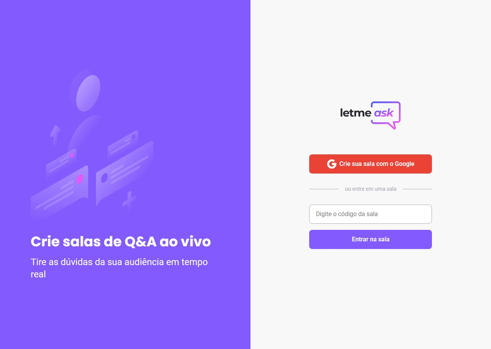

<h1 align="center">
  
</h1>

<p align="center">Aplicação desenvolvida durante a <strong>Next Level Week 6</strong>, com propósito de estudo.</p>

<p align="center">
  <a href="https://github.com/igormartins4/letmeask/graphs/contributors">
     
  </a>

  <a href="https://github.com/igormartins4/letmeask/stargazers">
    
  </a>

  <a href="https://github.com/igormartins4/letmeask/network">
    
  </a>

  

  <a href="https://github.com/igormartins4/clone-vercel-homepage/blob/main/LICENSE">
    
  </a>
</p>

<hr>

## Autor

| [<br><sub>@igormartins4</sub>](https://github.com/igormartins4) |
| :---: |

<br>

<p align="center">
  
</p>

## Tecnologias

Esse projeto foi desenvolvido com as seguintes tecnologias:

- HTML
- Sass
- JavaScript
- Typescript
- React
- Firebase
- Imagens SVG
  
## Acessar o projeto

Siga os passos abaixo para rodar-lo localmente em sua máquina.

(Confira se tem instalado na sua máquina o [Node](https://nodejs.org/en/) e o [Yarn](https://yarnpkg.com/))

1. Abra o terminal na pasta desejada para clonar o repositório e execute o comando:

```bash
git clone https://github.com/igormartins4/letmeask.git
```

2. Depois de concluído, execute os seguintes comandos para iniciar o server e será aberto no seu navegador uma aba com o projeto já funcionando:

```bash
cd letmeask
```

Para instalar as dependências:

```bash
yarn
```

Rodando o projeto:

```bash
yarn start
```

Observação: É necessário ter uma conta no Firebase e gerar credenciais para rodar o app por inteiro. Para isso, crie um arquivo _.env.local_ na raiz do projeto e coloque sua credenciais, após pegar-las no Firebase.

## Projeto

O _letmeask_ é uma aplicação para gerenciar melhor lives e reuniões de perguntas ou respostas, as Q&A. Por lá, o administrador pode organizar dúvidas por salas e marca-lás como respondidas ou até destacar-las.

## Layout

Você pode visualizar o layout do projeto através [desse link](https://www.figma.com/file/KOhD1Coq7K5uQCNKRFlMhO/Letmeask-(Copy)). É necessário ter conta no [Figma](https://figma.com) para acessá-lo.

## Licença

Esse projeto está sob a licença MIT. Veja o arquivo [LICENSE](LICENSE.md) para mais detalhes.

## Funcionalidades Extras

Ainda em construção...

<hr>

<h3 align="center" >Bora fazer aquele networking maroto?</h3>
<p align="center">
    <a href="https://www.linkedin.com/in/igormartins44/">LinkedIn</a> |
    <a href="https://www.instagram.com/titan.css">Instagram</a> |
    <a href="https://www.behance.net/titanstudio44">Behance</a>
</p>

<br />
<p align="center">
    Desenvolvido com 💙 por Igor Martins
</p>
